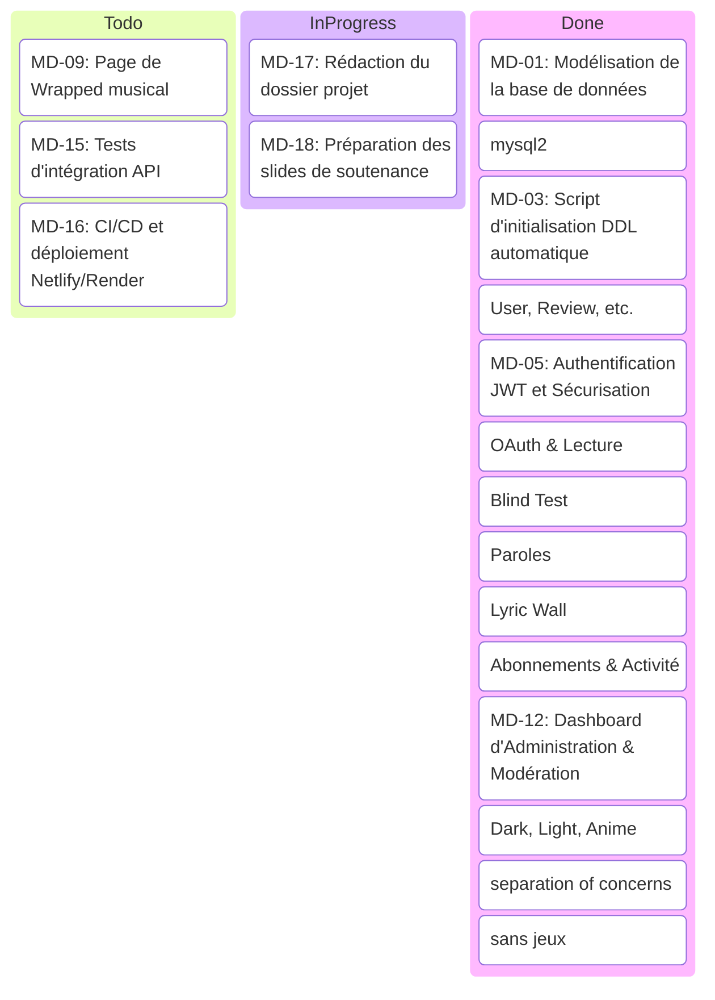

# 📋 Tableau de Projet GitHub - Music Diary

Ce document présente l'organisation des tâches (Kanban) du projet **Music Diary**. Il retrace l'intégralité du cycle de développement, de la phase de conception à la livraison finale du projet (y compris la refactorisation SQL et la création de la branche de présentation).

---

## 📊 État Global du Tableau Kanban

---

## 📝 Liste Détaillée des Tâches par Colonne

### 🟩 DONE (Terminé)

| ID | Catégorie | Titre de la tâche | Description | Assigné |
| :--- | :--- | :--- | :--- | :--- |
| **MD-01** | `Database` | Modélisation Conceptuelle (MCD) | Dessiner les entités (`User`, `Review`, `Follows`, `Report`, `Notification`, `Like`, `Comment`, `LyricPin`) et définir les relations avec contraintes d'intégrité (cascades). | Pharell |
| **MD-02** | `Backend` | Configuration du Pool MySQL | Remplacer Prisma par une connexion MySQL directe en implémentant un pool prometifié avec `mysql2/promise` robuste. | Pharell |
| **MD-03** | `Database` | Script DDL Automatique (`initDb.js`) | Écrire le script SQL s'exécutant au boot du serveur pour créer automatiquement les tables et relations manquantes sans effacer les données existantes. | Pharell |
| **MD-04** | `Backend` | Modèles SQL Explicites (MVC) | Écrire les modèles (ex: `User.js`, `Review.js`) en SQL brut paramétré (`db.query`) pour contrer les injections SQL. | Pharell |
| **MD-05** | `Security` | Authentification JWT & Hash | Mettre en place l'authentification avec `jsonwebtoken` et le hachage sécurisé des mots de passe en base avec `bcryptjs`. | Pharell |
| **MD-06** | `API` | Authentification Spotify OAuth 2.0 | Implémenter le flux d'autorisation (access token, refresh token) et synchroniser en arrière-plan la lecture live ("Now Playing"). | Pharell |
| **MD-07** | `API` / `Game` | Moteur Blind Test avec iTunes | Récupérer les extraits audio de 30 secondes d'iTunes et créer la boucle de jeu de 10 questions avec vinyle animé (GSAP). | Pharell |
| **MD-08** | `API` | Service de Paroles LRCLIB | Créer la route backend interrogeant LRCLIB et intégrant un cache mémoire TTL de 24h pour limiter les requêtes réseau. | Pharell |
| **MD-10** | `Frontend` | Mur de Paroles (Lyric Wall) | Permettre aux utilisateurs d'épingler des extraits de chansons avec couleur personnalisable sur leur profil public. | Pharell |
| **MD-11** | `Backend` | Flux d'Activité Sociale (Feed) | Développer la requête SQL récupérant les critiques rédigées uniquement par les personnes suivies par l'utilisateur connecté. | Pharell |
| **MD-12** | `Modération` | Dashboard d'Administration | Créer l'interface de modération : vue statistique, promotion des membres, avertissements/bannissements et modération des signalements. | Pharell |
| **MD-13** | `Frontend` | Gestion des Thèmes Dynamiques | Créer un sélecteur de thème dans la Sidebar gérant le stockage local (`localStorage`) et appliquant les classes CSS (`dark`, `light`, `anime`). | Pharell |
| **MD-14** | `Architecture` | Refactoring Container-Presenter | Isoler toute la logique d'état et d'API dans des hooks personnalisés (`useHomeData`, `useProfileData`) pour avoir des composants de vue légers (< 150 lignes). | Pharell |
| **MD-19** | `Git` | Branche de Présentation épurée | Créer la branche `presentation-sans-jeux` et nettoyer proprement les boutons de menu, routes et composants liés aux blind tests. | Pharell |

---

### 🟨 IN PROGRESS (En cours)

| ID | Catégorie | Titre de la tâche | Description | Assigné |
| :--- | :--- | :--- | :--- | :--- |
| **MD-17** | `Doc` | Rédaction du dossier projet | Structurer le rapport écrit décrivant l'architecture de l'application, les choix technologiques et les diagrammes de base de données. | Pharell |
| **MD-18** | `Doc` | Préparation des slides de soutenance | Construire la présentation visuelle résumant les défis techniques relevés (sécurité SQL, intégration Spotify, modularité React). | Pharell |

---

### 🟦 TO DO (À faire / Backlog)

| ID | Catégorie | Titre de la tâche | Description | Assigné |
| :--- | :--- | :--- | :--- | :--- |
| **MD-09** | `Frontend` | Wrapped de fin d'année musical | Mettre en forme une vue interactive présentant les statistiques annuelles d'écoutes de l'utilisateur sous forme de "stories". | Pharell |
| **MD-15** | `Tests` | Écriture des tests d'intégration | Mettre en place des tests d'intégration avec Jest/Supertest sur les routes d'authentification et de modération. | Pharell |
| **MD-16** | `DevOps` | Déploiement CI/CD automatique | Configurer le déploiement continu du frontend sur Netlify et de l'API Node sur un service comme Render ou Railway. | Pharell |
